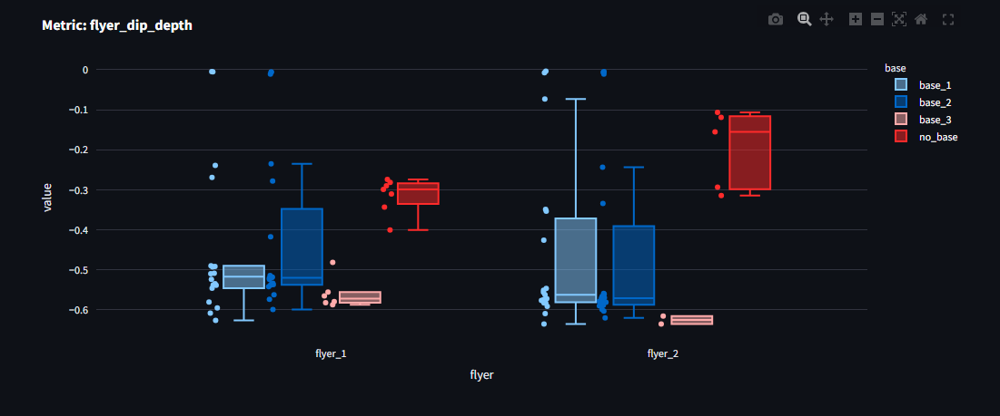
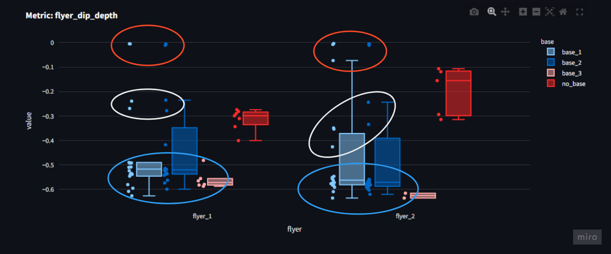
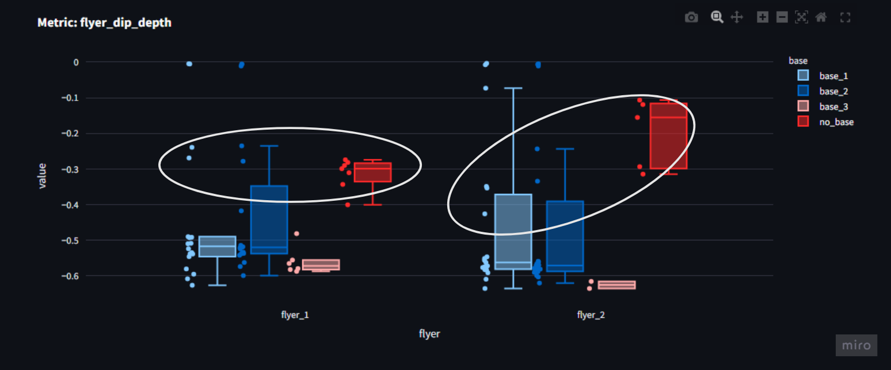

Lets explore the differences between a deep and a shallow dip. 

Remember that we are dealing with data from a small sample size. Also that these athletes were all used to a deeper dip.

# TL;DR

... will do some analysis before writing this ...

A deeper dip can help give some extra height, it did for these athletes. But extra height is not the only thing that matters.

... time to syncronize ...

### Explore the data yourself

The data from the whole experiment is visible in [this web app](https://stunt-analysis.streamlit.app/), best viewed on a larger screen (eg. laptop).

# Numeric Metrics

In order to compare many executions of the same movement. Lets choose some metrics that will allow us to but numbers into the comparison. A numeric metric is a single number, as opposed to a series of number that we have seen in a graph.

The metrics:
- From the pelvis position
    - pre-dip jump height
    - dip depth
    - maximum height
- From the pelvis velocity
    - maximum velocity
    - average velocity

Lets look at a graph of pelvis position and velocity to see where these numbers come from.

1) pre-dip jump height (pos)
2) dip depth (pos)
3) maximum velocity (vel)
4) average velocity (vel)
5) maximum height (pos)

As a collective, they give some overview of the characteristics of the graphs.

## A definition for a better toss

In order to also determine what is better, we need to choose what is important to us right now.

For the sake of this blog post, lets just take the **maximum toss height as the goal**, and consider the rep successful if it did not drop. With this in mind, we can look at how the metrics change based on the type of dip strategy used.

Thinking more broadly there are other very important things that we ignore completely in this analysis.

For example we could toss high, but still fail to catch. The alignment of the flyer could play a big role there. And we could definitely list out even more factors that we might want to focus on. 

Even subjective measures can help. As a coach do not underestimate the power of asking how a stunt felt. It might reveal things you cannot see by just looking or analyzing a video.

# Dip Depth vs Maximum Height

First lets have a look at the flyers dip depth for each execution.
The no-base attempts, are [counter-movement jumps (CMJ)](https://www.scienceforsport.com/countermovement-jump-cmj/)

In the data some groups form. 

The points high up (circled in red), with close to zero dip depth, are the deadtosses. 
There the flyer does not dip at all.

The ones in the middle (circled in white) are the shallow dips, where the flyer was instructed to dip very little.

And the ones in the bottom (circled in blue) are all the others, including where the flyers were instructed to dip deep.

Notice also that indeed when the flyers did CMJs then the dip depth is more like the shallow dip. Which is usually the case, when people are instructed to jump as high as possible, they do not dip down as low as possible.

### An error found in deep dip example

Here is an example of an error that can happen when using IMU base motion capture. It is hard to determine, where the surface starts and ends.

Here we see how the algorithm that detected surface level, made a mistake. And therefor the pelvis position data was also off for this example. Likely the velocity as well.

<video controls src="error-in-position.mp4" title="Error in position"></video>

A from the reference videos, the two attempts looked the same in regards to lowest position, but the metric was off, so I investigated.

.... show how dip depth and maximum height correlate

# Ideas to work on
... takes data from all deep dip and all shallow dip

show position graph, to showcase, that we can see the dip depth

relationship between metrics (plot one against the other, compute correlations)

curves comparison (sd of curves? normalised curves, from lowest position to catch)... lots of fun stuff to add

... first of all compare dip depth metric ... to show that indeed, one group of tosses is deep and other is not as deep
... show the bias, that regular dips for flyers were quite deep...

... compare max height metric (need to add it)
... compare max vel metric
... compare average velocity metric ()

... compare curves
.... see what is interesting

.... 