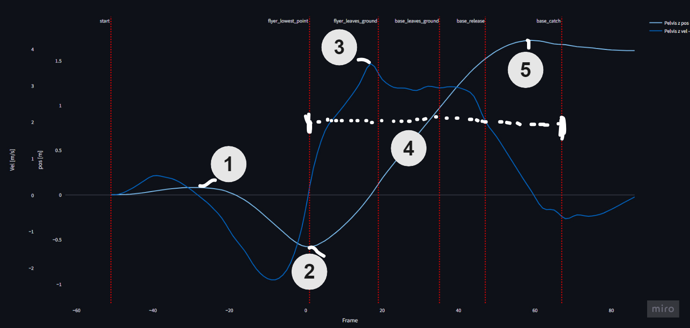

# Ideas to work on

... compare max height metric
... toss height vs dip depth
... compare max vel metric
... compare average velocity metric ()

... compare curves (perhaps skip)
.... see what is interesting

----- remove stuff above here later

Lets explore the differences between a deep and a shallow dip in this toss experiment dataset. And try to answer the question: 
- When the flyer dips deeper, does it help to increase toss height?

When interpreting the data, please remember that we are dealing with data from a small sample size. And all of these athletes were all used to a deeper dip.

# TL;DR

... will do some analysis before writing this ...

The data here suggests that a deeper dip can help increase toss height, it did help for these athletes. But extra height is not the only thing that matters.

... time to syncronize ... both deeper dip and higher pre-jump give more time to syncronise -> can make it easier for stunt couples less used to one another. A short and fast dip is harder to keep in sync -> can we measure this? -> I think so, but it is a topic for a future experiment.

### Explore the data yourself

The data from the whole experiment is visible in [this web app](https://stunt-analysis.streamlit.app/), best viewed on a larger screen (eg. laptop).

# Digging into the details

## Numeric Metrics

In order to compare many executions of the same movement. Lets choose some metrics that will allow us to put numbers into the comparison. A numeric metric is a single number, as opposed to a series of number that we have seen in a graph.

The metrics:
- From the pelvis position
    - pre-dip jump height
    - dip depth
    - maximum height
- From the pelvis velocity
    - maximum velocity
    - average velocity

Lets look at a graph of pelvis position and velocity to see where these numbers come from.

1) pre-dip jump height (pos)
2) dip depth (pos)
3) maximum velocity (vel)
4) average velocity (vel)
5) maximum height (pos)

As a collective, they give some overview of the characteristics of the graphs.

## A definition for a better toss

In order to also determine what is better, we need to choose what is important to us right now.

For now, lets take the **maximum toss height as the goal**, and consider the rep successful if it was caught. With this in mind, we can look at how the metrics change based on the type of dip strategy used.

Zooming out, there are other things that can play a role in a good successful toss. For example we could toss high, but if the flyers alignment is off, we could still fail to catch.

Even subjective measures can help. As a coach do not underestimate the power of asking how a stunt felt. It might reveal things you cannot see by just looking or analyzing a video.

## Dip Depth

First lets have a look at the flyers dip depth for each execution.

Defined by this calculation:
- Dip Depth = Hips position at lowest point - Hips position while standing

Negative numbers mean deeper dip. Zero means no dip.

Note that the red no-base attempts, are [counter-movement jumps (CMJ)](https://www.scienceforsport.com/countermovement-jump-cmj/)

Looking at the graph, we see some groups form in the data. Which I have highlighted in the image below

The points high up (circled in red), with close to zero dip depth, are the deadtosses. 
There the flyer does not dip at all.

The ones in the middle (circled in white) are the shallow dips, where the flyer was instructed to dip very little.

And the ones in the bottom (circled in blue) are all the others, including where the flyers were instructed to dip deep.

As all the flyers were used to dipping deeper, they did so when not instructed to do otherwise. Which is also visible in the plot, as all the other attempts fall into this group.

Also notice that when the flyers did CMJs then the dip depth is more like the shallow dip. Which is usually the case, when people are instructed to jump as high as possible, they do not dip super deep.

## Toss Height

Now lets have a look at the same type of graph for the toss height.

As defined by:
- Toss Height = Hips position highest point before catch - Hips position while standing

Higher numbers mean higher toss.

Now we can immediately see that the CMJs are not even close to the tosses. So we can see that in this skill, removing the base from the toss part would make it really difficult to catch the flyer onto ones hands :D. Which would be really fun and impressive to see someone do.

-- image to showcase difference in graph

Zooming in a bit we also see, that tosses with flyer 2 were generally higher than with flyer 1.

-- image remove no base and draw line to show difference

But within a single base and flyer, there are no clear groups as there was on the dip depth metric graph. There is a more general spread of toss heights. 

Just hovering on a few top and bottom ones we can see which ones are which. This reveals that the lowest ones are the deadtosses and deadtoss attempts. The highest ones varied.

In order to get a better idea of the relation between the two metrics. Lets gather them in a single plot.

## Dip Depth vs Toss Height

So in this next plot we will see Dip Depth on one axis and Toss Height on the other. Each point represents the same execution of the stunt.

.... show how dip depth and maximum height correlate
--- implement one metric vs other metric

## Theory and discussion: 

Why can deeping deeper help?

Why don't we dip deep in back tucks or CMJs?

## Curves comparison

-- might even skip this for this round. will see

"Perhaps just very clear examples. 1 base 1 flyer, different styles, eg as in instagram post"
Lets look at the time series for a few examples.

.. hmm want to look at all base flyer combos here, curves are not conclusive here.
currently feeling like heavier flyer -> bigger difference between deep and shallow dip?
not sure about the positions now, as one of the deep dip ones was completely off.

-- update graph view (select base / flyer / style in filter somehow, to more quickly select. - here the preselect idea could also be interesting)

... take curves from insta story, i think they are in miro, nope not on miro, just screenshots in story. But i did like those, could redo.

# Bonus stuff

### An error found in deep dip example

Here is an example of an error that can happen when using IMU base motion capture. It is hard to determine, where the surface starts and ends.

Here we see how the algorithm that detected surface level, made a mistake. And therefor the pelvis position data was also off for this example. Likely the velocity as well.

<video controls src="error-in-position.mp4" title="Error in position"></video>

A from the reference videos, the two attempts looked the same in regards to lowest position, but the metric was off, so I investigated.