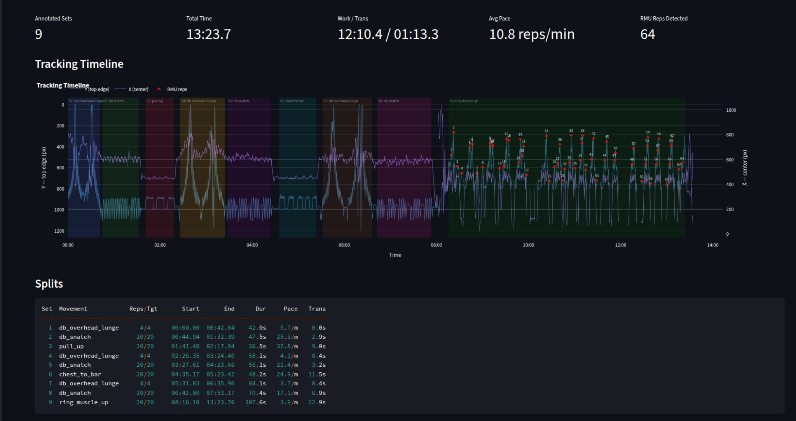
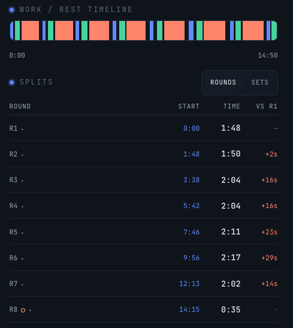
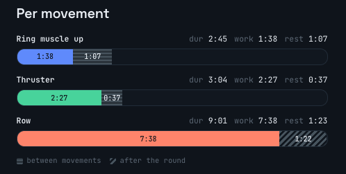
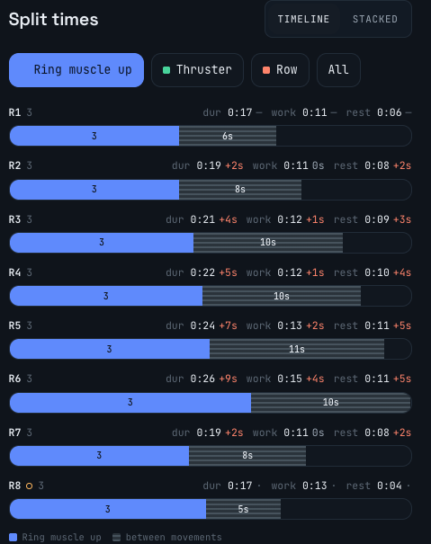
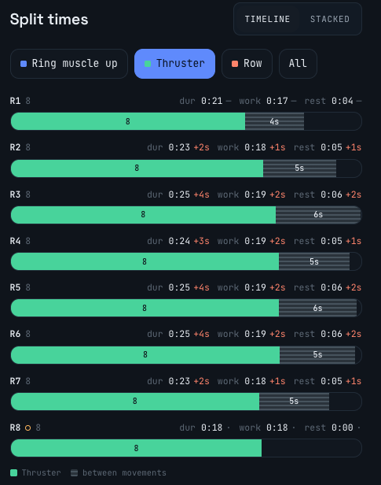
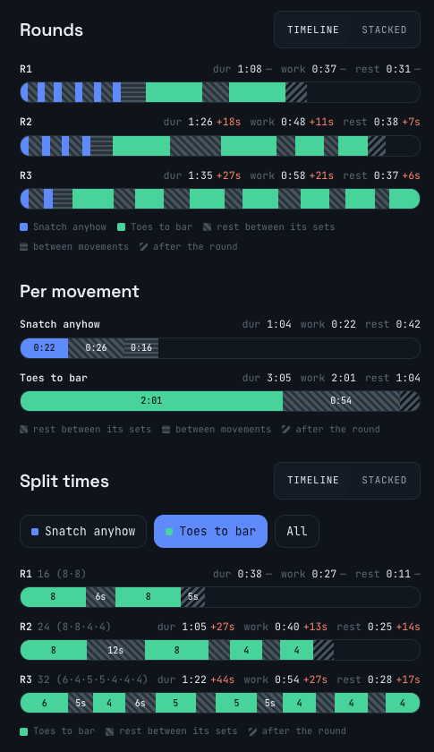

## Journey into CrossFit and Functional Fitness

October 2026 has started. Feeling like dumping some thoughts into writing.

Beginning of last year I walked into [CrossFit KeKo](https://www.crossfitkeko.ee/) to do my first ever CrossFit class. In September 2026, I took part in my first ever CrossFit competition. End of 2025 I was honoured with the opportunity to represent Estonia in the IF3 World Championships. In July 2025, I took part in the IF3 European Championships. This year I am preparing for the IF3 World Championships, with focused intent.

Long term my goal is to keep feeling well, no aches or pains, getting stronger and fitter in my 30s. And maintaining as well as I can as the years go on. One day, to qualify to be a really fit grandpa.


## Getting curious about analytics in CrossFit workouts

During my first ever [CrossFit Open](https://games.crossfit.com/open/overview) I felt there was potential to learn about how to perform the workouts better, optimizing my strategy based on my current capabilities.

I started building some tooling, so I could get my split times. Visualise where I spent more time, thinking about where to push or how hard to push. With the goal of getting a better score. 

I definitely learned a thing or two. Being young to the sport, I did not have the experience to know where a workout could be won or lost.

For example, looking at the [26.2 CF Open workout](https://games.crossfit.com/workouts/open/2026/2)

```
26.2 CF Open workout:
- 80ft OH Walking Lunge -> 20 Alt. DB Snatch -> 20 Pull Ups
- 80ft OH Walking Lunge -> 20 Alt. DB Snatch -> 20 Chest to Bar Pull-Ups
- 80ft OH Walking Lunge -> 20 Alt. DB Snatch -> 20 Ring Muscle Ups

22.5kg dumbbell
```

I was contemplating on how to split the lunges, snatches, and pull-up variants. Without realizing the workout was all about the RMU.


So when planning the re-do. It was about pacing the start reasonably, and splitting the RMUs so I would not get to failure.

## A lot of enthusiasm building

I thought, well anyone could find their splits manually. But could we automate it? I have worked a bunch with movement analysis during my time at [Qualisys](https://www.qualisys.com/).

So bit by bit I started and evolved what I could do with it.

By now I have spent a lot of time building the tooling. Partially driven by the addictive nature of building software with tools like [Claude Code](https://claude.com/product/claude-code).

First analyses were just text dumps, as seen above. Then as the data was there I started playing with dashboard style visuals. Earlier visual of the 26.2 CF Open workout analysis.



Step by step I was building parts of the system with the goal of making it usable for me in an everyday setting, without too much extra effort.

Today, I am recording all my CrossFit style workouts, as well as most of my strength training, weightlifting and skill work sessions. Feeding the videos through what is currently called the [Wod Capture](https://wod-capture.uk/) system.


## What is useful

The main value of it for me is to validate or invalidate how I felt I did in a workout, what the workout was really about. Over time, this helps me hone my own gut feeling about how to attack a workout.

So by just recording and uploading a workout, I can see how well I was able to keep my pace in a workout.

### Seeing how much I slowed down

Recently I tried out the 2026 French Throwdown Qualifier workout.
[FTD26 Qualifier Workout 1](https://competitioncorner.net/events/french-throwdown-2026-online-qualifiers/workouts?f=individual&d=123382&w=114987)

[Wod-capture report](https://wod-capture.uk/r/46ae544b-6974-4feb-8288-949a11c2d9a6)

Even though I did pace it, there was some slowdown.


When I looked at the workout, I felt that the row will take up quite some time.



And from looking at the numbers, the row took the majority of the time. 

I was also curious as to how my RMUs and thrusters would hold here. At this pace, I did still keep all rounds Unbroken. Overall the pace held quite steady for those, but some seconds here and there add up.




Top scores for elite were at 10 rounds, while I managed 7.5 rounds. So I am sure they were rowing a lot faster and likely had fast transitions and faster cycle time on the thrusters.

### Building confidence for competition workout strategy

In the summer there was the [Fittest in Tartu](https://www.fittestintartu.ee/) competition.

```
Workout 6:

FOR TIME 6:00
- 6 Snatch
- 16 Toes to Bar
- 4 Snatch
- 24 Toes to Bar
- 2 Snatch
- 32 Toes to Bar

Bar - 70kg for RX men.
```

Snatches - worth doing touch and go? TTB - how will I hold on?

After doing it and checking out the report ([Wod Capture](https://www.wod-capture.uk/r/3ff15c9a-51f1-4f03-a50b-5859a88ac7db)), I was sure there was no point in not going singles in the snatches. Since TTB was the part where it took most time, and where I could potentially blow up.


