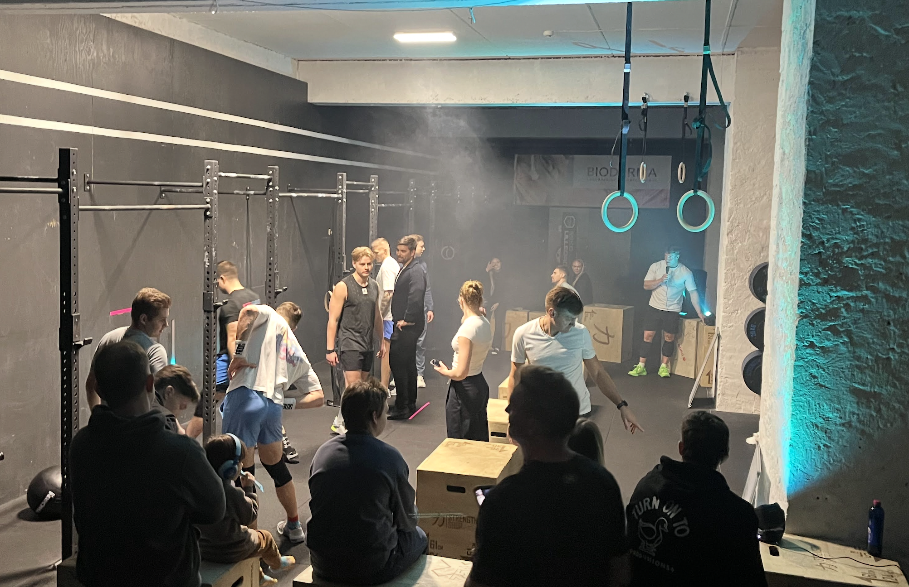
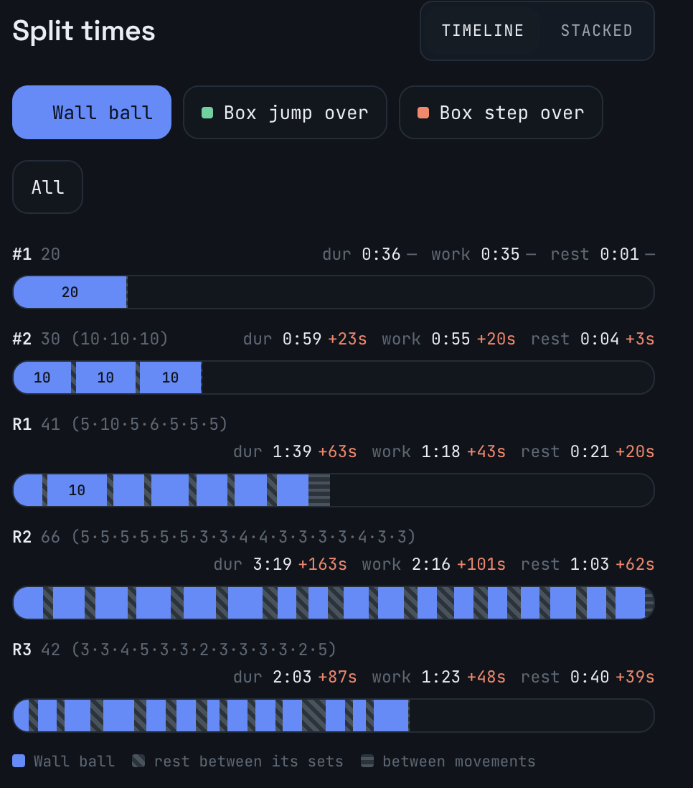
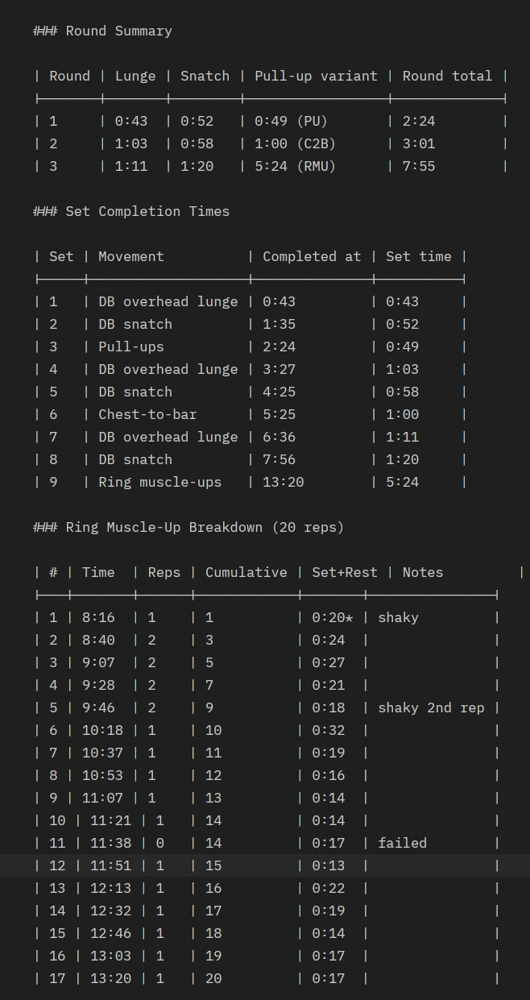
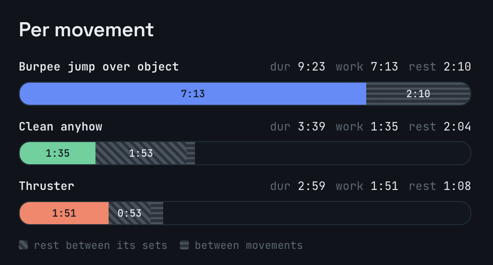
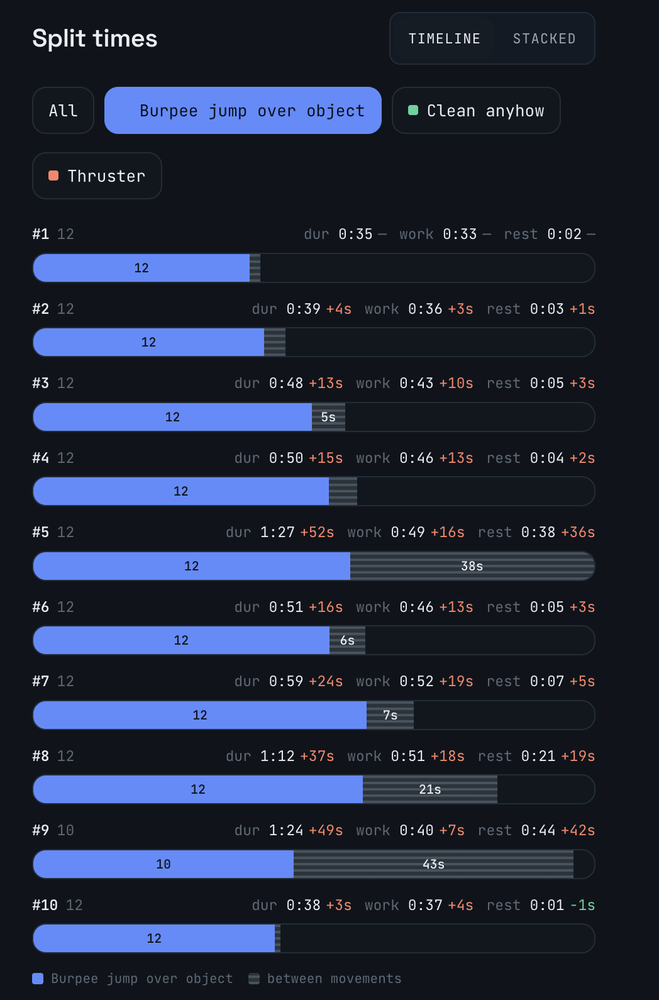
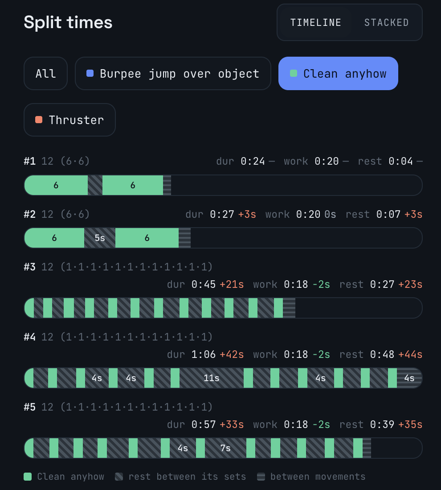
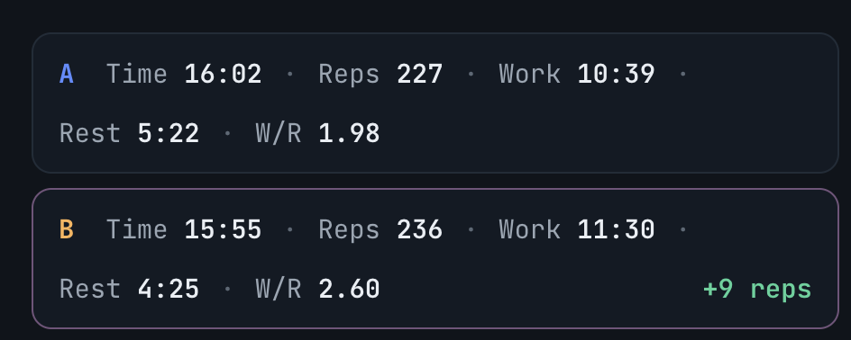

# Rookie in the 2026 CrossFit Open

## 26.1


During the 2026 [CrossFit Open](https://games.crossfit.com/open/overview). [CrossFit KeKo](https://www.crossfitkeko.ee/) organized a whole spectacle with athletes from the box performing the the open workouts each week.

My first ever CF Open. Shiny lights, smoke and music banging. People ready to see the locals getting their sweat on.



The 26.1 bringing a lot of wall balls and a lot of getting over the box. 


```
26.1 CF Open workout

20 Wall-Balls	  
  Followed by 18 Box Jump-Overs
30 Wall-Balls	  
  Followed by 18 Box Jump-Overs
40 Wall-Balls	  
  Followed by 18 Medicine-Ball Box Step-Overs
66 Wall-Balls (Peak)	
  Followed by 18 Medicine-Ball Box Step-Overs
40 Wall-Balls	  
  Followed by 18 Box Jump-Overs
30 Wall-Balls	  
  Followed by 18 Box Jump-Overs
20 Wall-Balls	 

• Time Cap: 12 minutes

```

In my heat, the co-founder and top male CrossFit athlete [Miko Lilleorg](https://www.instagram.com/mikolilleorg) was beside me. A 12 minute amrap waiting, I went for it... And soon enough I learned, that was not a pace I could hold. 

Wall ball sets of 20, 10-10-10 dwindled into 2s and 3s. I was barely keeping composure on the box. I went out hot.

**Lesson one**: the pace I could hold for 2 minutes is far from the pace I can hold for 12 minutes. The movements were not difficult, but my capacity to do a lot of them fast was at a lower level.

!! ADD BEFORE AND AFTER SCORES

## Tools to help me learn

After the first open workout I wanted to understand pacing better. I started writing down split times manually. 

Doing this and seeing value from it, I was inspired to automate it. Step by step I started building the [Wod Capture](https://wod-capture.uk/) system. Leaning on the expirience working with movement analysis systems from my time with [Qualisys](https://www.qualisys.com/)

With this I can now visualise the timeline clearly. And compare each rounds work time, rest time, and see how I split each segment.



## 26.2

I took my learning and started to plan ahead for the 26.2. 

```
26.2 CF Open workout

80ft OH Walking Lunge -> 20 Alt. DB Snatch -> 20 Pull Ups
80ft OH Walking Lunge -> 20 Alt. DB Snatch -> 20 Chest to Bar Pull-Ups
80ft OH Walking Lunge -> 20 Alt. DB Snatch -> 20 Ring Muscle Ups

22.5kg dumbbell

• Time Cap: 15 minutes
```

I had my plan on how to attack the lunges, the snatches, the pull-ups. But my novice approach did not see the obvious. The start did not matter as much, if my RMUs were slow and difficult.

In this workout, the limiting factor was not endurance, even though the time cap was 15 minutes, which hints at a potentially longer workout. It was my skill level and capacity at doing Ring Muscle Ups.


To paint the picture, I looked at how time it took to finish each section. And RMUs took more than 1/3 of the whole workout.



The rest of the movements also slowed down round by round, which indicates I was getting too tired already.

!!! ADD IMAGESES OF HOW  LUNGES AND SNATCHES SLOWED

**Lesson two**: One movement can play an outsized role in the workout. In this case the RMU, where I had a skill gap compared to people ahead of me. 

For the re-do I planned to pace the rest at a more even pace. And later focus on getting my RMUs better in general. 

!!! ADD BEFORE AND AFTER SCORES?

## 26.3


The final workout of the open. I felt confident with the burpees, but uncertain with how I could handle the barbell.

```
26.3 CF Open workout

6 rounds total, with 2 rounds at each weight:

12 Burpees Over the Bar
  12 Cleans
12 Burpees Over the Bar 
  12 Thrusters

Rounds 1-2: 43kg
Rounds 3-4: 52kg
Rounds 5-6: 61kg

• Time Cap: 16 minutes

```

After the first attempt I remember being smoked. But determined to give it one more try as I did with the other ones.

So even though burpees were the bulk of this workout. As seen in the per movement breakdown.



Then after looking at the data and discussing with KeKo coaches, the revised plan included going a bit slower on the burpees.



This in combbination with doing singles from the start for cleans, would hopefully save me energy and get me more reps.

As we can see from the clean round by round breakdown. I could not hold consistent pace with the singles and took long breaks between reps.



All in all, managed to get +9 reps in my second attempt.



While burpees were a bit slower, I was able to keep composure on the cleans and push until the very last set of thrusters.


## Pacing

The overall idea I have now for pacing is to start just slow enough, so that we have energy to finish strong.

But knowing the pace in each section is not always easy, since there are many nuances that go into tuning in the proper pace. Depending on one skill level, strenght, work capacity in general as well as work capacity of certain muscles in certain movements.

With enough experience, we can learn how to do it well. And this is where data can help us. Be our companion on the road of learning and become ultimately become smarter athletes along the way.

...
